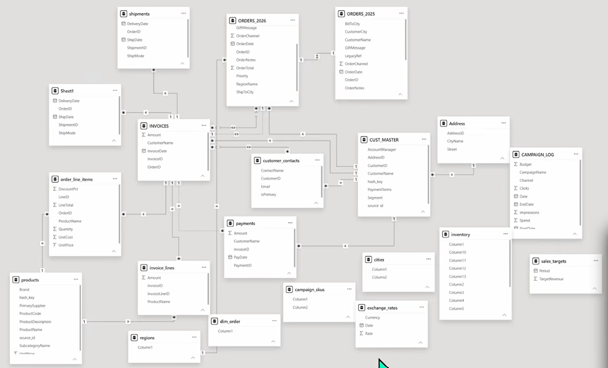
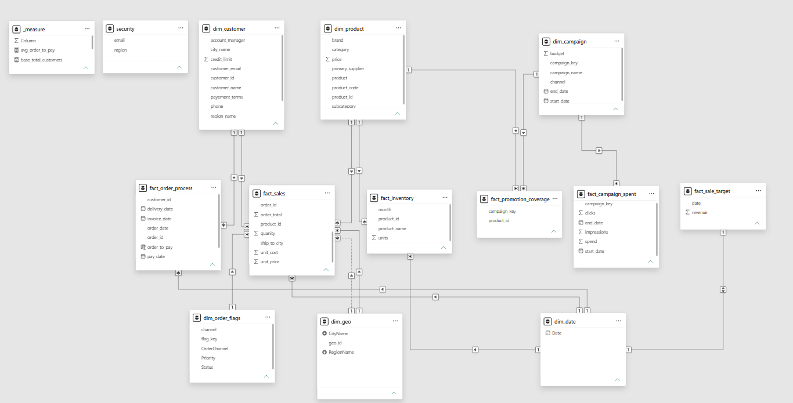

# Power BI Data Modeling – Nightmare Data Model

## 📌 Project Overview

An end-to-end Power BI data modeling project focused on transforming 23 messy source tables into a clean and scalable analytical data model.

The project follows dimensional modeling and star-schema principles to create a structured Power BI semantic model suitable for business reporting and analysis.

---

## 🎯 Project Objectives

- Explore and understand 23 complex source tables
- Identify fact and dimension tables
- Design a clean star schema
- Build appropriate table relationships
- Create reusable DAX measures
- Build a Date dimension
- Validate relationships and data
- Create a business-ready Power BI semantic model

---

## 🏗️ Data Modeling Approach

The original dataset consisted of 23 source tables containing different business entities and transactional information.

The tables were analyzed and transformed into fact and dimension tables to create a structured analytical model.

### Dimension Tables

- Customer Dimension
- Product Dimension
- Date Dimension
- Other supporting dimensions

### Fact Tables

- Sales Fact
- Inventory Fact
- Campaign Fact
- Order Fulfillment Fact

---

## 🔄 Before vs After Modeling

### Before Modeling

The original model contained 23 source tables with a complex and unstructured setup.

### After Modeling

The tables were reorganized into a structured analytical model following star-schema principles.

---

## ⭐ Star Schema

The final model follows a star-schema approach where fact tables contain measurable business events and dimension tables provide descriptive attributes.

---

## 🧠 Key Concepts Implemented

- Star Schema
- Dimensional Modeling
- Fact Tables
- Dimension Tables
- Primary & Foreign Keys
- Table Relationships
- Cardinality
- Filter Direction
- Date Dimension
- DAX Measures
- Data Validation
- Power Query
- Power BI Semantic Modeling

---

## 🛠️ Tools & Technologies

- Power BI Desktop
- Power Query
- DAX
- Dimensional Data Modeling

---

## 📚 Key Learning Outcomes

Through this project, I gained practical experience in:

- Understanding complex source data
- Identifying the correct grain of fact tables
- Separating facts from dimensions
- Designing star-schema models
- Creating relationships between tables
- Building reusable DAX measures
- Creating analytical data models for Power BI
- Validating a semantic model before reporting

---

## 📂 Project Files

- [Before Modeling](Before_modeling.png)
- [After Modeling](After_modeling.png)
- [Power BI Project](Data%20Modeling%20Project.pbix)

---

## 🔗 Reference

This project was completed as a practical learning exercise based on the **Power BI Data Modeling / Nightmare Data Model** project by Data with Baraa.

The project was used to develop practical understanding of real-world Power BI data modeling and star-schema design.
